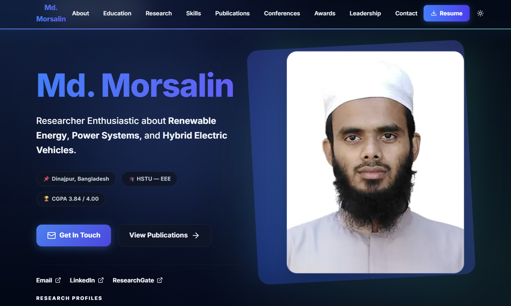
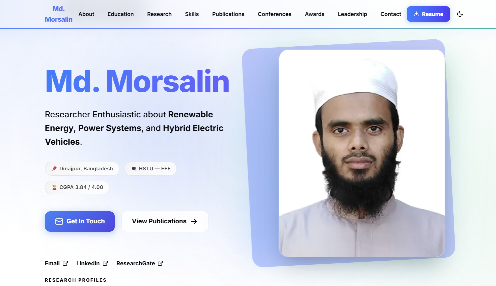

# Md. Morsalin — Academic Portfolio

Personal academic portfolio for **Md. Morsalin**, Final-year EEE student and researcher at Hajee Mohammad Danesh Science and Technology University (HSTU), Bangladesh. Specializes in Renewable Energy, Power Systems, Power System Stability, and Hybrid Electric Vehicles.

🔗 **Live:** [mdmorsalin.com](https://mdmorsalin.com)

---

## Preview

| Dark Mode | Light Mode |
|-----------|------------|
|  |  |

---

## Tech Stack

| Layer | Technology |
|-------|-----------|
| Framework | Next.js 16 (App Router) |
| Styling | Tailwind CSS v4 |
| Animations | Framer Motion |
| Icons | Lucide React |
| Theming | next-themes (dark / light mode) |
| Email | Nodemailer + Gmail SMTP |
| Toast Notifications | Sonner |
| UI Primitives | Radix UI |

---

## Features

- 🌙 **Dark / Light Mode** — smooth toggle with system preference detection
- 📱 **Fully Responsive** — desktop, tablet, and mobile optimized
- 📬 **Contact Form → Gmail** — submissions delivered directly to inbox via Nodemailer
- 📄 **Resume Download** — one-click PDF download from navbar
- 🔍 **Professional SEO** — JSON-LD structured data, Open Graph, Twitter Cards, sitemap, robots.txt
- 🔬 **Research Profile Links** — Google Scholar, ORCID, Scopus, Web of Science
- ⚡ **Smooth Scroll Navigation** — active section detection with animated indicator

---

## Getting Started

### Prerequisites
- Node.js 18+
- A Gmail account with a [Gmail App Password](https://myaccount.google.com/apppasswords) generated

### Installation

```bash
# 1. Clone the repository
git clone https://github.com/YOUR_USERNAME/morsalin-portfolio-website.git
cd morsalin-portfolio-website

# 2. Install dependencies
npm install

# 3. Create environment file and fill in your values
cp .env.local.example .env.local

# 4. Start the development server
npm run dev
```

Visit [http://localhost:3000](http://localhost:3000) in your browser.

---

## Environment Variables

Create a `.env.local` file in the root with:

```env
# Site URL
NEXT_PUBLIC_SITE_URL=https://mdmorsalin.com

# Gmail — for contact form email delivery
GMAIL_USER=your_gmail@gmail.com
GMAIL_APP_PASSWORD=your_16_char_app_password
CONTACT_RECEIVER_EMAIL=your_gmail@gmail.com
```

> **How to get a Gmail App Password:**
> 1. Enable **2-Step Verification** on your Google account
> 2. Go to → [myaccount.google.com/apppasswords](https://myaccount.google.com/apppasswords)
> 3. Generate a password for "Mail" → paste the 16-character code as `GMAIL_APP_PASSWORD`

---

## Customization

All site content lives in a **single file**:

```
src/data/portfolio.js
```

Edit this file to update personal info, education, publications, skills, awards, research interests, and navigation links — no other files need to be changed.

---

## Project Structure

```
src/
├── app/
│   ├── api/contact/   # Contact form API (Nodemailer, no DB)
│   ├── layout.js      # Root layout + full SEO metadata
│   ├── page.js        # Home page (all sections assembled)
│   ├── sitemap.js     # Auto-generated sitemap for Google
│   └── robots.js      # Crawler directives
├── components/
│   ├── layout/        # Navbar, Footer
│   ├── sections/      # Hero, About, Education, Publications, etc.
│   └── ui/            # ThemeToggle, shared primitives
├── data/
│   └── portfolio.js   # ← All content lives here
└── lib/
    └── utils.js
```

---

## Deployment (Vercel)

1. Push your repo to GitHub
2. Import it at [vercel.com/new](https://vercel.com/new)
3. Add environment variables under **Settings → Environment Variables**
4. Click **Deploy** — done

---

## Research Profiles

| Platform | Profile |
|----------|---------|
| Google Scholar | [View Profile](https://scholar.google.com/citations?user=a-vhwUwAAAAJ&hl=en) |
| ORCID | [0009-0007-1398-5418](https://orcid.org/0009-0007-1398-5418) |
| Scopus | [View Profile](https://www.scopus.com/authid/detail.uri?authorId=60128929700) |
| Web of Science | [NDS-9522-2025](https://www.webofscience.com/wos/author/record/NDS-9522-2025) |

---

## License

All rights reserved © Md. Morsalin. This project is for personal academic use.
